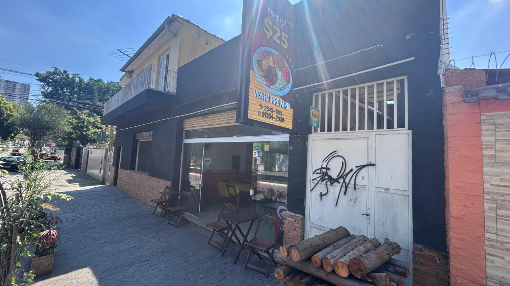
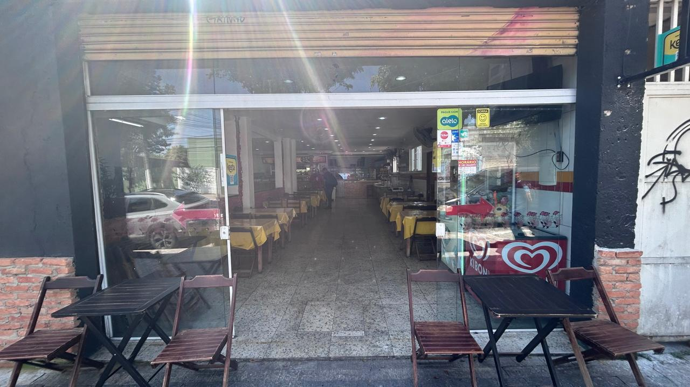
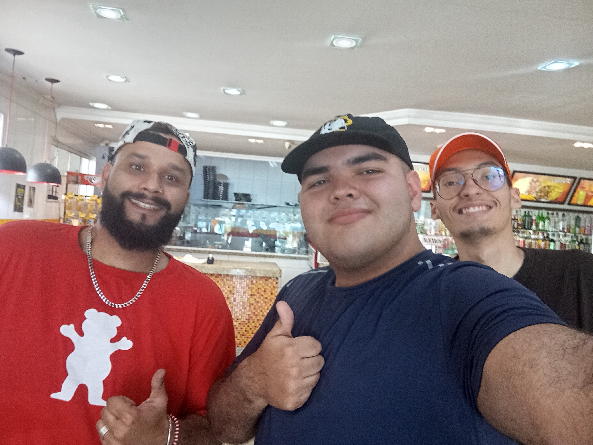
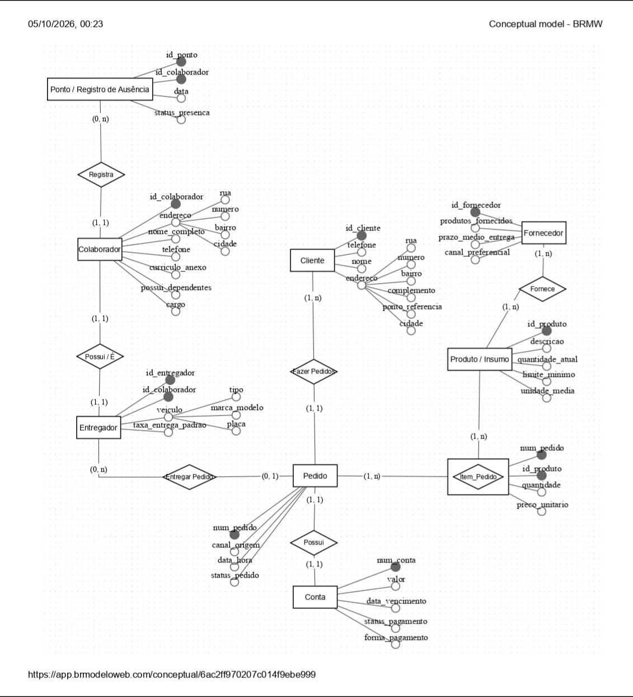

# Entrega 1 — Modelo Conceitual (DER)
### Modelagem de um sistema de gestão de informações para uma organização de pequeno porte

---

## Metadados

- *Matheus Nogales dos Santos, RGM: 47810629*
- *Carlos Eduardo ALves Lopes da Silva, RGM: 48465097*
- *Lucas Gabriel de Oliveira Castro, RGM: 47627891*
- *Karoline Almeida de Araújo, RGM: 48379867*

## 1. Caracterização da Organização

- **Nome e natureza da organização:** *Bar do Ernesto - Restaurante e Pizzaria*
- **Contexto e porte:** *Organização com fins lucrativos; médio porte; no momento, possui 9 colaboradores; volume de vendas regular.*
- **Problemas e necessidades identificados:** *O maior problema identificado é falta de organização e controle no estoque.*
- **Justificativa da escolha:** *Um dos membros do grupo já era familiar com o dono do local*
- **Evidências da organização:** *R. Abel Tavares, 2470 - Jardim Belem, São Paulo*

 

---

## 2. Processos de Negócio

- **Principais processos mapeados:** *Cadastros de cliente; Sistema de entrega; Fornecimento de ingrediente/utilidades; Cadastro de Funcionários; Controle de estoque.*

---

## 3. Requisitos do Sistema

### 3.1 Requisitos Funcionais
*O que o sistema precisa FAZER (ex.: "o sistema deve permitir registrar uma venda").*
- O sistema deve permitir o registro de clientes;
- O sistema deve permitir o registro de colaboradores e entregadores; 
- O sistema deve permitir a edição de endereço e número de telefone.

### 3.2 Requisitos Não Funcionais
- Dados sensiveís como telefone e endereço devem ser criptografados e armazenados de forma segura;
- Páginas com dados não sensiveís devem carregar em menos de 2 segundos;
- O sistema deve permanecer ativo por aproximadamente 60% - 65% do dia.
---

## 4. Regras de Negócio

- **Regras operacionais:**
  - *Identificador Principal*: Número do telefone/WhatsApp cadastrado como nome de identificação.
  - *Endereço de Entrega*: Campo Obrigatório (Rua, número, bairro, complemento e ponto de referência). Sem endereço, o pedido não pode    ser finalizado.
  - *Canais de Origem*: Registro da origem da venda (iFood, 99, Ligação Direta ou WhatsApp).
  informada.
  - *Logística Interna*: Configuração específica para os 1 a 2 Motoboys (controle de taxas de entrega, entregas concluídas e rotas).
  - Módulo de Fornecedores
  - *Dados do Cadastro*: Nome do fornecedor, produtos fornecidos e prazo médio de entrega.
  - *Canais de Pedido Preferenciais*: Marcação do canal direto para compras (Aplicativo, WhatsApp ou Ligação Telefônica).

---

## 5. Modelagem Conceitual (Entidades, Atributos, Relacionamentos)

- **Entidades reconhecidas:**
  - *Cliente* = quem solicita e recebe pedidos à longa distância;
  - *Colaborador* = quem trabalha permanentemente num estabelecimento público ou privado;
  - *Entregador* = encarregado da entrega das compras ao cliente;
  - *Pedido* = item do cardápio que o cliente requisitou;
  - *Conta* = pagamento a ser feito pelo serviço/pedido;
  - *Produto* = matéria-prima que compõem o pedido;
  - *Fornecedor* = aquele que fornece os produtos para o restaurante;
  - *Ponto* = registro de presença do colaborador.

- **Atributos e classificações:**
  - *nome* = Cliente, Colaborador, Entregador;
  - *telefone* = Cliente, Colaborador, Entregador;
  - *endereco* (Atributo Composto) = Cliente, Colaborador;
    - *rua* = Cliente, Colaborador;
    - *numero* = Cliente, Colaborador;
    - *bairro* = Cliente, Colaborador;
    - *cidade* = Cliente, Colaborador.
  - *descricao* = Produto;
  - *valor* = Conta;
  - *data_vencimento* = Conta;
  - *canal_origem* = Pedido;
  - *data_hora* = Pedido;
  - *status_pedido* = Pedido;
  - *status_pagamento* = Conta;
  - *forma_pagamento* = Conta;
  - *quantidade_atual* = Produto;
  - *limite_minimo* = Produto;
  - *unidade_media* = Produto;
  - *produtos_fornecidos* = Fornecedor;
  - *prazo_medio_entrega* = Fornecedor;
  - *canal_preferencial* = Fornecedor;
  - *veiculo* = Entregador;
    - *tipo* = Entregador;
    - *marca_modelo* = Entregador;
    - *placa* = Entregador.
  - *taxa_entrega_padrao* = Entregador;
  - *curriculo_anexo* = Colaborador;
  - *possui_dependentes* = Colaborador;
  - *cargo* = Colaborador;
  - *data* = Ponto;
  - *status_presenca* = Ponto;
  - *id_cliente*;
  - *id_colaborador* = Colaborador, Entregador, Ponto;
  - *id_entregador*;
  - *id_produto*;
  - *id_fornecedor*;
  - *id_ponto*;
  - *num_pedido*;
  - *num_conta*.

- **Relacionamentos pertinentes:**
  - *Fazer Pedido*;
  - *Entregar Pedido*;
  - *Possui*;
  - *Itens Pedidos*;
  - *Fornece*;
  - *Pode ser*;
  - *Registra*;

---

## 6. Diagrama Entidade-Relacionamento (DER)

---

## 7. Justificativa Técnica

*O grupo decidiu todos esses elementos para o diagrama, pois eles foram o que mais se encaixava e relacionava com o restaurante que estamos nos baseando, além de também termos discutido esse tema com o dono do restaurante, pedindo a opinião do mesmo com o que é necessário para a modelagem do banco de dados*

---

## 8. Uso de Inteligência Artificial

| Item | O que registrar |
|------|------------------|
| **Ferramenta e etapa** | O Gemini foi utilizado para auxiliar no desenvolvimento do DER, mostrando um exemplo de como poderíamos desenvolver o diagrama. |
| **Motivação** | Nossa motivação para utilizá-la, foi para agilizar o desenvolvimento do diagrama. |
| **Prompt(s) utilizados** | "Crie um DER (Diagrama Entidade Relacionamento) geral e conceitual, que mapeie todos os principais processos do restaurante. Utilize as entidades, atributos e relacionamentos que citamos além da liberdade de criar mais deles. Os atributos endereço e tipos de veiculos devem ser compostos."  |
| **Resposta recebida** | Foi recebido uma proposta de DER baseado em nosso material que foi mapeado pelo grupo (Entidades, atributos, relacionamentos, e outros materiais que foram anotados durante a nossa visita ao restaurante). |
| **Fontes consultadas e verificadas** | A maioria das fontes fornecidas foram do conteúdo que disponibilizamos para a mesma. |
| **Trechos rejeitados ou corrigidos** | O DER foi feito manualmente, e no meio de seu desenvolvimento, substituímos atributos e relacionamentos, afim de melhorar o entendimento sobre o diagrama. |
| **Justificativa da escolha final** | A IA manteve todas as nossas entidades, relacionamentos e atributos, e portanto, decidimos manter e melhorar esse modelo. |
| **Reflexão crítica** | Um erro bastante perceptível na IA, foi a repetição de atributos e até mesmo adicionando atributos e relacionamentos desnecessários para o diagrama. |

---
